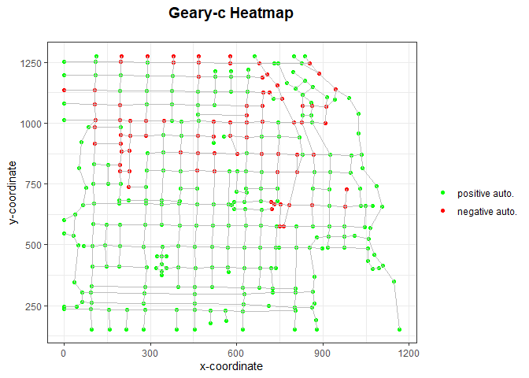

<!-- README.md is generated from README.Rmd. Please edit that file -->

# IntensityNet

<!-- badges: start -->

<!-- badges: end -->

The IntensityNet package provides tools to analyze point patterns in
space over planar network structures derived from graph-related
intensity measures for undirected, directed, and mixed networks. This
package is based on the research done by Eckardt, M., Mateu, J.
presented in the following papers: <br> <br> Eckardt, M., Mateu, J.
Point Patterns Occurring on Complex Structures in Space and Space-Time:
An Alternative Network Approach. Journal of Computational and Graphical
Statistics 27. 312-322 (2017).
<a href="https://doi.org/10.1080/10618600.2017.1391695" target="_blank">10.1080/10618600.2017.1391695</a>
<br> <br> Eckardt, M., Mateu, J. Second-order and local characteristics
of network intensity functions. TEST 30, 318-340 (2021).
<a href="https://doi.org/10.1007/s11749-020-00720-4" target="_blank">10.1007/s11749-020-00720-4</a>

## Installation

You can install the released version of intensitynet from
[CRAN](https://CRAN.R-project.org) with:

``` r
install.packages("IntensityNet")
```

And the development version from [GitHub](https://github.com/) with:

``` r
# install.packages("devtools")
devtools::install_github("LlagosteraPol/IntensityNet")
```

## Example

This is an example that shows you how to set up IntensityNet and
calculate and plot the Geary-c correlation:

``` r
library(IntensityNet)
library(spatstat)
#> Loading required package: spatstat.data
#> Loading required package: spatstat.geom
#> spatstat.geom 2.3-1
#> Loading required package: spatstat.core
#> Loading required package: nlme
#> Loading required package: rpart
#> spatstat.core 2.3-2
#> Loading required package: spatstat.linnet
#> spatstat.linnet 2.3-1
#> 
#> spatstat 2.3-0       (nickname: 'That's not important right now') 
#> For an introduction to spatstat, type 'beginner'
data(chicago)
chicago_df <- as.data.frame(chicago[["data"]]) # Get as dataframe the data from Chicago

# Get the adjacency matrix. One way is to create an igraph object from the edge coordinates.
edges <- cbind(chicago[["domain"]][["from"]], chicago[["domain"]][["to"]])
chicago_net <- igraph::graph_from_edgelist(edges)

# And then use the igraph function 'as_adjacency_matrix'
chicago_adj_mtx <- as.matrix(igraph::as_adjacency_matrix(chicago_net))
chicago_node_coords <- data.frame(xcoord = chicago[["domain"]][["vertices"]][["x"]], 
                                  ycoord = chicago[["domain"]][["vertices"]][["y"]])

# Create a dataframe with the coordinates of the events 'assault'
chicago_assault <- chicago_df[chicago_df$marks == 'assault',]
assault_coordinates <- data.frame(xcoord = chicago_assault[,1],
                                  ycoord = chicago_assault[,2])
                                   
# Create the intensitynet object, in this case will be undirected 
intnet_chicago <- intensitynet(chicago_adj_mtx, 
                               node_coords = chicago_node_coords, 
                               event_coords = assault_coordinates)

intnet_chicago <- CalculateEventIntensities(intnet_chicago)
#> Calculating edge intensities...
#> ================================================================================
#> Calculating node intensities...
#> ================================================================================

data_geary <- NodeLocalCorrelation(intnet_chicago, dep_type = 'geary', intensity = igraph::vertex_attr(intnet_chicago$graph)$intensity)
geary_c <- data_geary$correlation
intnet_chicago <- data_geary$intnet

PlotHeatmap(intnet_chicago, heattype='geary')
```


